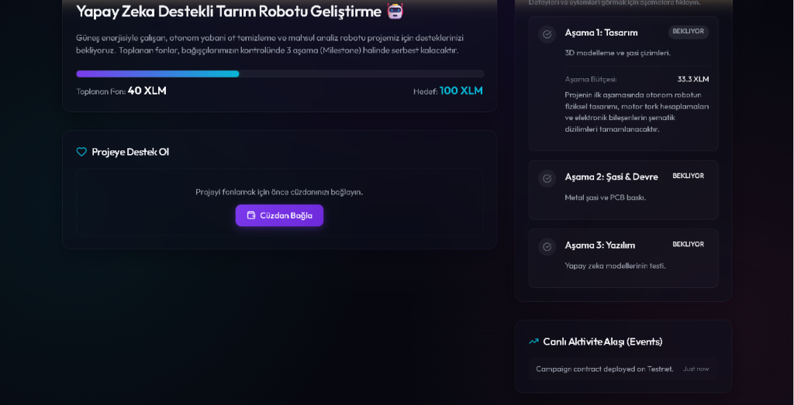
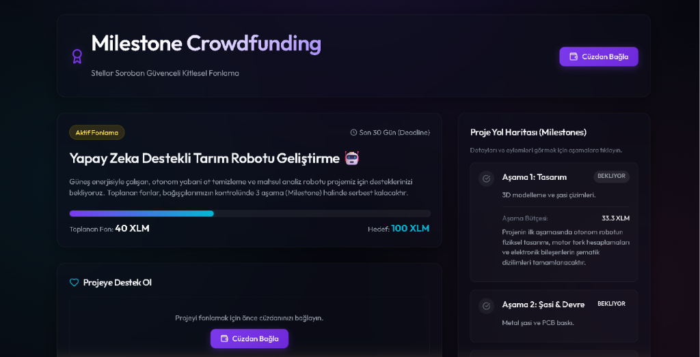
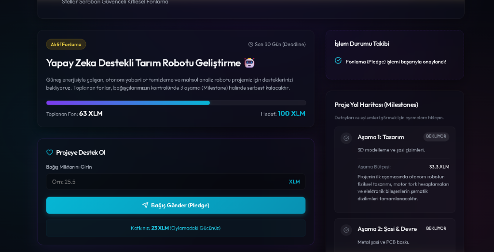
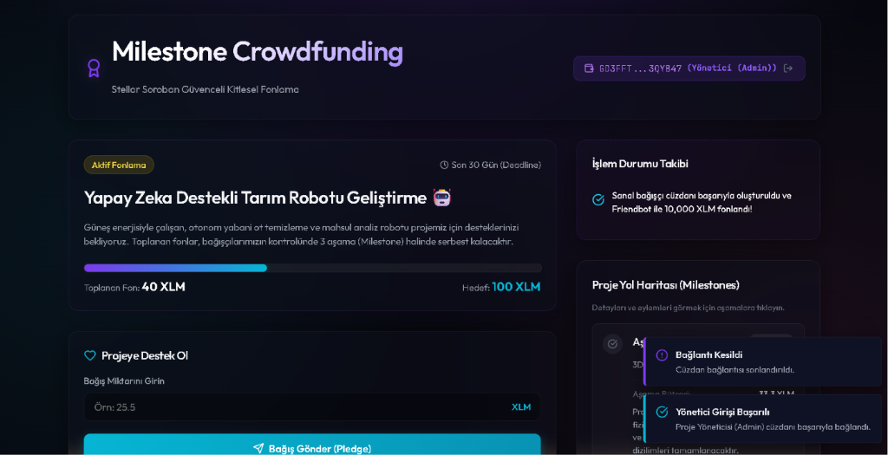

# Stellar Soroban Güvenceli Aşamalı Kitlesel Fonlama (Milestone-Based Crowdfunding)

Stellar Soroban akıllı sözleşme altyapısı üzerine inşa edilmiş, şeffaf, güvenli ve aşamalı (milestone-based) bir kitlesel fonlama (crowdfunding) platformu.

Bu proje, fonların proje sahibine tek seferde aktarılması yerine, proje sahibinin önceden belirlediği aşamaları (Milestones) tamamlayıp kanıtlar sunması ve bu kanıtların bağışçılar tarafından oylanarak onaylanması esasına dayanır.

---

## 📸 Uygulama Ekran Görüntüleri

### 1. Genel Panel Görünümü


### 2. Çoklu Cüzdan Modal Arayüzü (Eklentisiz Geliştirici Cüzdanları Dahil)


### 3. Başarılı Bağış İşlemi (Pledge) ve Canlı Bakiye Güncellemesi


### 4. Yönetici Girişi ve İşlem Durumu Takibi


---

## ✨ Öne Çıkan Özellikler

- **Soroban Akıllı Sözleşmesi (Rust):** Fonların güvenli bir şekilde emanet kasasında (escrow) tutulması, aşamaların ve oyların tamamen on-chain (zincir üstü) yönetilmesi.
- **Sanal Geliştirici Cüzdanları (Mock Wallets):** Tarayıcı eklentisi gerektirmeyen, **Sanal Bağışçı** (rastgele anahtar çifti üretip Testnet Friendbot ile 10,000 XLM fonlar) ve **Sanal Yönetici** cüzdanları ile anında sıfır kurulumlu blockchain test imkanı.
- **Çoklu Cüzdan Desteği:** Freighter, Albedo (Web API) ve Hana cüzdan entegrasyonları.
- **Akıllı Yol Haritası (Milestones):** Genişletilebilir interaktif aşama kartları ve admin rolüyle doğrudan yol haritası kartı içerisinden kanıt yükleme.
- **Kapsamlı Hata Yönetimi:** Cüzdan bulunamadı, yetersiz bakiye ve işlem reddedildi durumlarının şık Toast bildirimleriyle yakalanması.
- **Canlı Aktivite Akışı (Events):** Soroban RPC Event API'si üzerinden zincir üzerindeki bağış ve oy işlemlerinin sayfayı yenilemeden anlık izlenebilmesi.

---

## 🛠️ Teknoloji Yığını (Tech Stack)

- **Akıllı Sözleşme:** Rust, Soroban SDK
- **Önyüz:** React 18, TypeScript, Vite
- **Tasarım:** Vanilla CSS (Glassmorphism / Modern Koyu Tema), Lucide Icons
- **Blockchain Bağlantısı:** `@stellar/stellar-sdk`, `@creit.tech/stellar-wallets-kit`

---

## ⚙️ Kurulum ve Çalıştırma

### Gereksinimler
- Rust ve `wasm32-unknown-unknown` derleme hedefi
- [Stellar CLI](https://developers.stellar.org/docs/tools/stellar-cli)
- Node.js (v18+) ve npm

### 1. Akıllı Sözleşmeyi Derleme ve Test Etme
Sözleşme dizinine gidin ve testleri çalıştırın:
```bash
cd contracts/crowdfunding
cargo test
```

Sözleşmeyi WebAssembly (Wasm) olarak derleyin:
```bash
stellar contract build
```

### 2. Önyüzü Çalıştırma
Önyüz dizinine gidin, bağımlılıkları yükleyin ve yerel geliştirici sunucusunu başlatın:
```bash
cd frontend
npm install
npm run dev
```
Uygulamayı tarayıcınızda **`http://localhost:5173`** (veya terminalde belirtilen portta) açarak sanal cüzdanlar vasıtasıyla test etmeye başlayabilirsiniz.

---

## 📂 Git Commit Geçmişi

Proje geliştirme sürecinde aşağıdaki anlamlı commit'ler atılmıştır:
1. `feat: implement milestone crowdfunding smart contract with unit tests`
2. `feat: implement premium glassmorphic frontend dashboard with wallet connection and error handling`
3. `feat: add virtual developer wallets, interactive milestones, and compliance dashboard`
4. `style: remove compliance checklist panel for clean production layout`
5. `fix: pass publicKey parameter to all write transaction calls to resolve FakeAccountError`
